# 📘 Documentação de Utilização - VendaShow 1.0.0

## ⚙️ Parâmetros de Desenvolvimento

- **Banco de Dados**: Firebird 2.5  
- **Versão do Delphi**: Delphi 12.3 Athens  
- **Componentes não nativos**:
  - ACBr  
  - Ethea Styled Components Library  
  - Fast Report 2024.2.5  

---

## 🖥️ Configuração

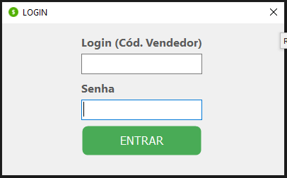

1. Antes da utilização do sistema, certifique-se de que o **Firebird está executando** na máquina.  
2. Copie a pasta `..\Aplicação\` para o disco (ex.: `C:\Aplicação`).

---

## 🔐 Execução

1. O sistema possui **tela de login**. Só será possível acessar com credenciais válidas.  
   - Login inicial: `7`  
   - Senha: `147852`

1.1. Se o login ou senha estiverem incorretos, o acesso será bloqueado por validação.

---

## 🏠 Tela Inicial

- Contém um **menu principal** com acesso às funções e uma **barra de status** com informações do sistema e do vendedor logado.
- Cada menu possui **submenus**.

### 2.1 Menu Cadastro  
### 2.2 Menu Relatórios  
### 2.3 Menu Venda

---

## 👥 Cadastro de Clientes

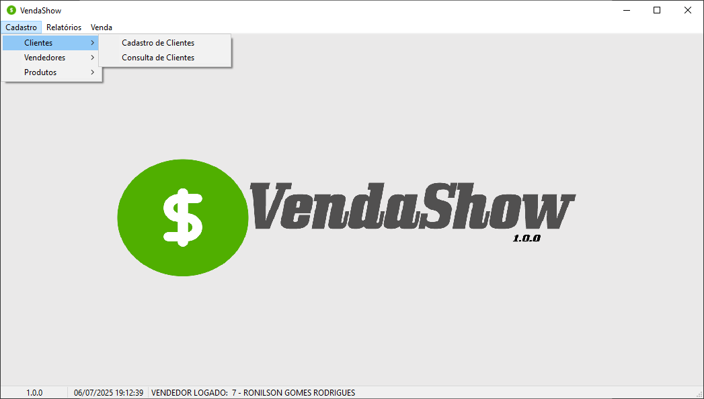

Acesse `Cadastro > Clientes > Cadastro de Clientes`:

- Preencha o **CEP** e ao sair do campo, o sistema **completa automaticamente**:
  - Endereço, Bairro, Cidade e UF
- Preencha **Número e Complemento** e clique em **Gravar**

Acesse `Cadastro > Clientes > Consulta de Clientes`:

- Permite **pesquisar clientes cadastrados**
- Clique duas vezes no grid para **editar** o cliente

---

## 👤 Cadastro de Vendedores

Acesse `Cadastro > Vendedores > Cadastro de Vendedores`:

- Funcionalidade idêntica ao cadastro de clientes
- Exemplo usado: Senha `12345`, código gerado: `10`
- Após cadastro, já é possível logar com esse vendedor

---

## 📦 Cadastro de Produtos

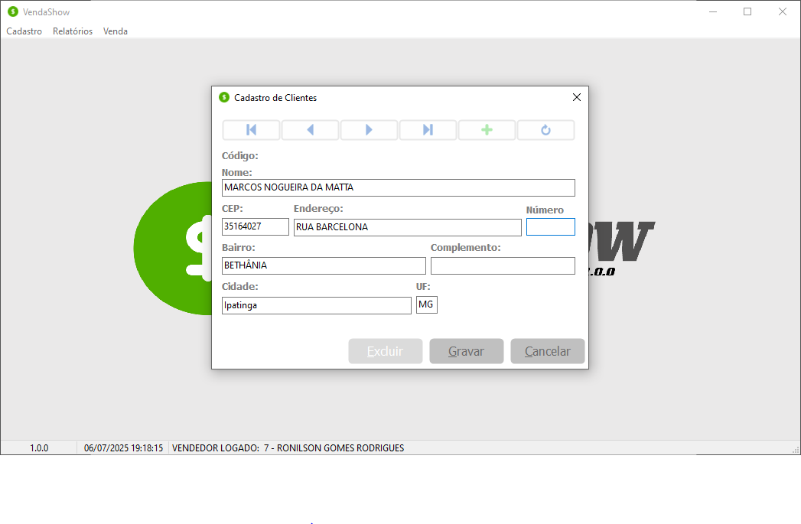

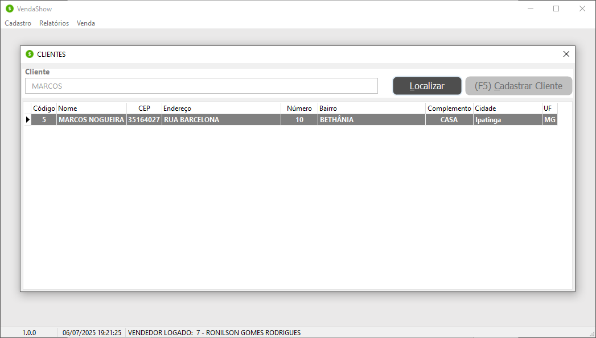

Acesse `Cadastro > Produtos > Cadastro de Produtos` para cadastrar novos produtos.

Acesse `Cadastro > Produtos > Consulta de Produtos` para consultar e editar produtos já cadastrados.

---

## 🛒 Venda de Produtos

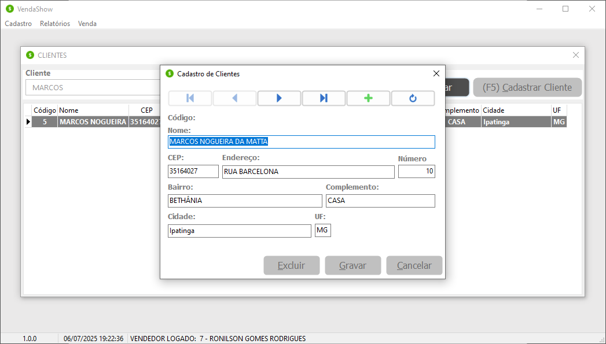

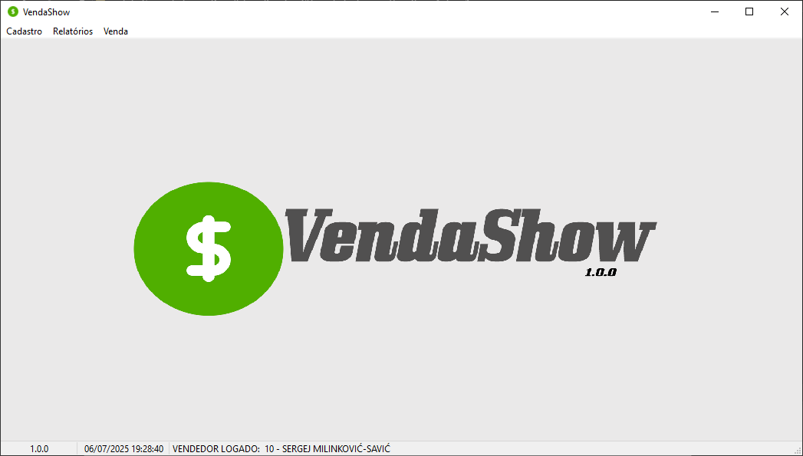

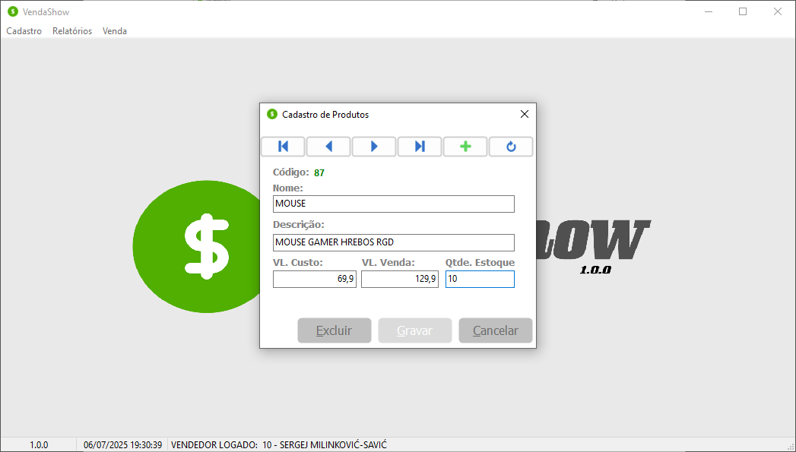

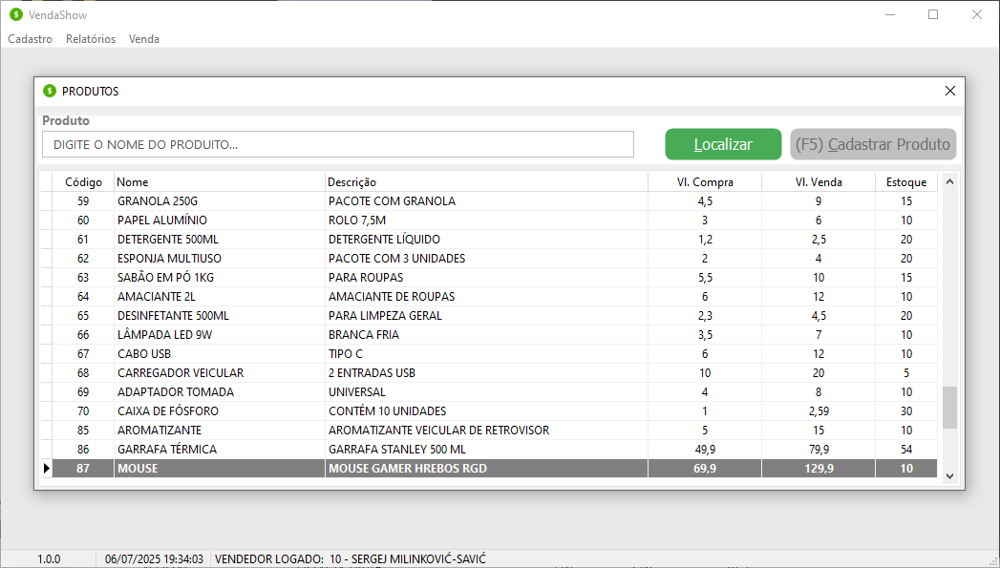

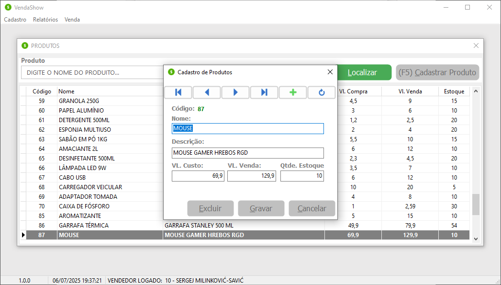

Acesse `Vendas > Nova Venda`:

- Tela de vendas com:
  - **Formas de pagamento** (podem adicionar acréscimos)
  - **Descontos automáticos** aplicados no valor total

### 7.1 Vendedor logado
- Nome e código do vendedor logado são atribuídos à venda automaticamente

### 7.2 Identificar Cliente
- Botão **Identificar Cliente** (`F1`) abre tela de busca
- Cliente pode ser identificado no início ou no encerramento da venda (obrigatório)

### 7.3 Selecionar Cliente
- Clique duplo seleciona e exibe os dados na tela da venda

### 7.4 Adicionar Item
- Botão **Adicionar Item** (`F2`) abre tela de busca de produtos

### 7.5 Selecionar Produto
- Clique duplo abre tela de quantidade desejada

### 7.6 Quantidade e Acréscimo
- Valor total será ajustado conforme a forma de pagamento (ex: 10% a mais no cartão)

### 7.7 Conceder Desconto
- Botão **Conceder Desconto** (`F5`)
- Valor informado é aplicado automaticamente

### 7.8 Excluir Item
- Botão **Excluir Item** (`F4`) remove item do grid e atualiza o total

### 7.9 Encerrar Venda
- Botão **Encerrar Venda** (`F6`) encerra a venda e mostra mensagem de sucesso

### 7.10 Consultar Vendas
- Botão **Consultar Vendas** (`F2`) permite buscar vendas já realizadas
- Botão **Imprimir Consulta** (`F5`) imprime os resultados

---

## 📉 Estoque

- Ao vender produtos, o estoque é automaticamente **reduzido**.
- Pode ser confirmado em `Cadastro > Produtos > Consulta de Produtos`.

---

## 🔍 Consulta e Exclusão de Vendas

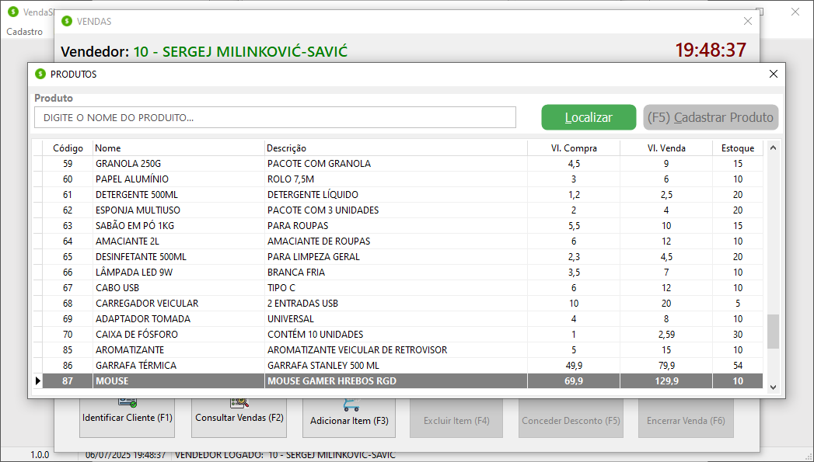

Acesse `Venda > Consultar Venda`:

- Mesmo recurso da tela de vendas (item 7.10), com diferença:
  - **Clique duplo** mostra detalhes completos da venda

---

## 🗑️ Exclusão de Cadastros

- Telas de cadastro (Clientes, Vendedores, Produtos) permitem exclusão
- O sistema só permite exclusão se **não houver vínculos com vendas**
- Caso contrário, os registros são **inativados**

### 10.1 Cadastro de Produtos  
### 10.2 Cadastro de Vendedores  
### 10.3 Cadastro de Clientes

---

## 🔒 Cadastros Inativados

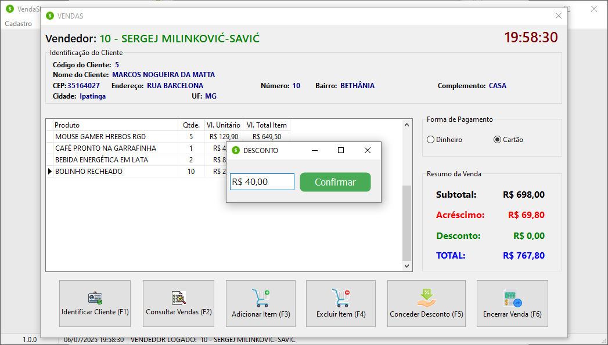

- Cadastros inativados são **ignorados em consultas e login**
- Para reativar, é necessário agir diretamente no **banco de dados**

---

> **📝 Observação**: Este manual se refere à versão **VendaShow 1.0.0**
